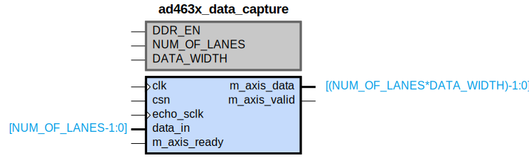

# ad463x_data_capture

## Parameters

| Parameter | Default Value | Description |
| --------- | ------------- | ----------- |
| DDR_EN | 0 | NA |
| NUM_OF_LANES | 2 | NA |
| DATA_WIDTH | 32 | NA |
| Component_Name | ad463x_data_capture_v1_0 | NA |

## Buses

### m_axis
| Logical | Physical | Type |
| ------- | -------- | ---- |
| TREADY | m_axis_ready | axis |
| TVALID | m_axis_valid | axis |
| TDATA | m_axis_data | axis |

### m_axis_signal_clock
| Logical | Physical | Type |
| ------- | -------- | ---- |
| CLK | clk | clock |

## Registers