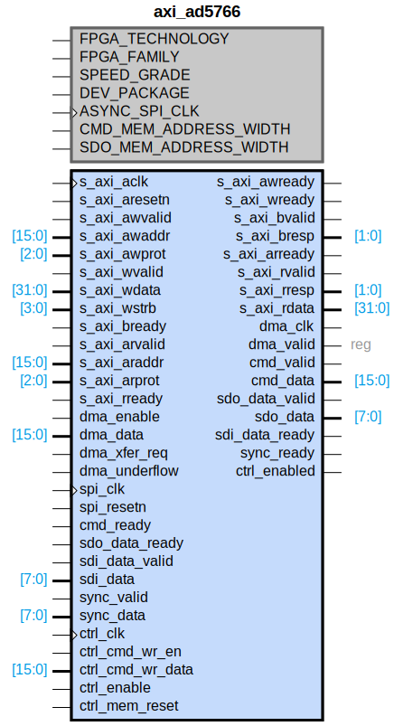

# axi_ad5766

## Parameters

| Parameter | Default Value | Description |
| --------- | ------------- | ----------- |
| FPGA_TECHNOLOGY | 0 | NA |
| FPGA_FAMILY | 0 | NA |
| SPEED_GRADE | 0 | NA |
| DEV_PACKAGE | 0 | NA |
| ASYNC_SPI_CLK | 0 | NA |
| CMD_MEM_ADDRESS_WIDTH | 4 | NA |
| SDO_MEM_ADDRESS_WIDTH | 4 | NA |
| Component_Name | axi_ad5766_v1_0 | NA |

## Buses

### s_axi
| Logical | Physical | Type |
| ------- | -------- | ---- |
| AWADDR | s_axi_awaddr | aximm |
| AWPROT | s_axi_awprot | aximm |
| AWVALID | s_axi_awvalid | aximm |
| AWREADY | s_axi_awready | aximm |
| WDATA | s_axi_wdata | aximm |
| WSTRB | s_axi_wstrb | aximm |
| WVALID | s_axi_wvalid | aximm |
| WREADY | s_axi_wready | aximm |
| BRESP | s_axi_bresp | aximm |
| BVALID | s_axi_bvalid | aximm |
| BREADY | s_axi_bready | aximm |
| ARADDR | s_axi_araddr | aximm |
| ARPROT | s_axi_arprot | aximm |
| ARVALID | s_axi_arvalid | aximm |
| ARREADY | s_axi_arready | aximm |
| RDATA | s_axi_rdata | aximm |
| RRESP | s_axi_rresp | aximm |
| RVALID | s_axi_rvalid | aximm |
| RREADY | s_axi_rready | aximm |

### s_axi_aclk
| Logical | Physical | Type |
| ------- | -------- | ---- |
| CLK | s_axi_aclk | clock |

### s_axi_aresetn
| Logical | Physical | Type |
| ------- | -------- | ---- |
| RST | s_axi_aresetn | reset |

### spi_engine_ctrl
| Logical | Physical | Type |
| ------- | -------- | ---- |
| CMD_READY | cmd_ready | spi_engine_ctrl |
| CMD_VALID | cmd_valid | spi_engine_ctrl |
| CMD_DATA | cmd_data | spi_engine_ctrl |
| SDO_READY | sdo_data_ready | spi_engine_ctrl |
| SDO_VALID | sdo_data_valid | spi_engine_ctrl |
| SDO_DATA | sdo_data | spi_engine_ctrl |
| SDI_READY | sdi_data_ready | spi_engine_ctrl |
| SDI_VALID | sdi_data_valid | spi_engine_ctrl |
| SDI_DATA | sdi_data | spi_engine_ctrl |
| SYNC_READY | sync_ready | spi_engine_ctrl |
| SYNC_VALID | sync_valid | spi_engine_ctrl |
| SYNC_DATA | sync_data | spi_engine_ctrl |

### spi_engine_offload_ctrl
| Logical | Physical | Type |
| ------- | -------- | ---- |
| CMD_WR_EN | ctrl_cmd_wr_en | spi_engine_offload_ctrl |
| CMD_WR_DATA | ctrl_cmd_wr_data | spi_engine_offload_ctrl |
| ENABLE | ctrl_enable | spi_engine_offload_ctrl |
| ENABLED | ctrl_enabled | spi_engine_offload_ctrl |
| MEM_RESET | ctrl_mem_reset | spi_engine_offload_ctrl |

### spi_engine_offload_ctrl_signal_clock
| Logical | Physical | Type |
| ------- | -------- | ---- |
| CLK | ctrl_clk | clock |

### spi_engine_ctrl_signal_clock
| Logical | Physical | Type |
| ------- | -------- | ---- |
| CLK | spi_clk | clock |

### spi_engine_ctrl_signal_reset
| Logical | Physical | Type |
| ------- | -------- | ---- |
| RST | spi_resetn | reset |

### dma_fifo_tx_signal_clock
| Logical | Physical | Type |
| ------- | -------- | ---- |
| CLK | dma_clk | clock |

## Registers