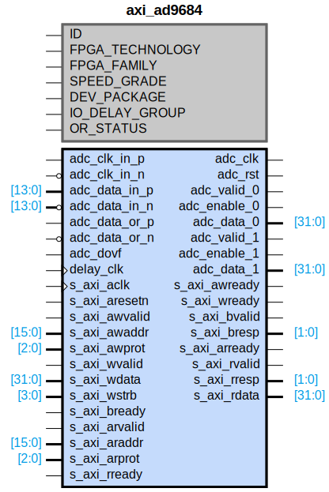

# axi_ad9684

## Parameters

| Parameter | Default Value | Description |
| --------- | ------------- | ----------- |
| ID | 0 | NA |
| FPGA_TECHNOLOGY | 0 | NA |
| FPGA_FAMILY | 0 | NA |
| SPEED_GRADE | 0 | NA |
| DEV_PACKAGE | 0 | NA |
| IO_DELAY_GROUP | dev_if_delay_group | NA |
| OR_STATUS | 1 | NA |
| Component_Name | axi_ad9684_v1_0 | NA |

## Buses

### s_axi
| Logical | Physical | Type |
| ------- | -------- | ---- |
| AWADDR | s_axi_awaddr | aximm |
| AWPROT | s_axi_awprot | aximm |
| AWVALID | s_axi_awvalid | aximm |
| AWREADY | s_axi_awready | aximm |
| WDATA | s_axi_wdata | aximm |
| WSTRB | s_axi_wstrb | aximm |
| WVALID | s_axi_wvalid | aximm |
| WREADY | s_axi_wready | aximm |
| BRESP | s_axi_bresp | aximm |
| BVALID | s_axi_bvalid | aximm |
| BREADY | s_axi_bready | aximm |
| ARADDR | s_axi_araddr | aximm |
| ARPROT | s_axi_arprot | aximm |
| ARVALID | s_axi_arvalid | aximm |
| ARREADY | s_axi_arready | aximm |
| RDATA | s_axi_rdata | aximm |
| RRESP | s_axi_rresp | aximm |
| RVALID | s_axi_rvalid | aximm |
| RREADY | s_axi_rready | aximm |

### s_axi_aclk
| Logical | Physical | Type |
| ------- | -------- | ---- |
| CLK | s_axi_aclk | clock |

### s_axi_aresetn
| Logical | Physical | Type |
| ------- | -------- | ---- |
| RST | s_axi_aresetn | reset |

### adc_clk_in_p
| Logical | Physical | Type |
| ------- | -------- | ---- |
| CLK | adc_clk_in_p | clock |

### adc_clk_in_n
| Logical | Physical | Type |
| ------- | -------- | ---- |
| CLK | adc_clk_in_n | clock |

### delay_clk
| Logical | Physical | Type |
| ------- | -------- | ---- |
| CLK | delay_clk | clock |

### adc_clk
| Logical | Physical | Type |
| ------- | -------- | ---- |
| CLK | adc_clk | clock |

### adc_rst
| Logical | Physical | Type |
| ------- | -------- | ---- |
| RST | adc_rst | reset |

## Registers