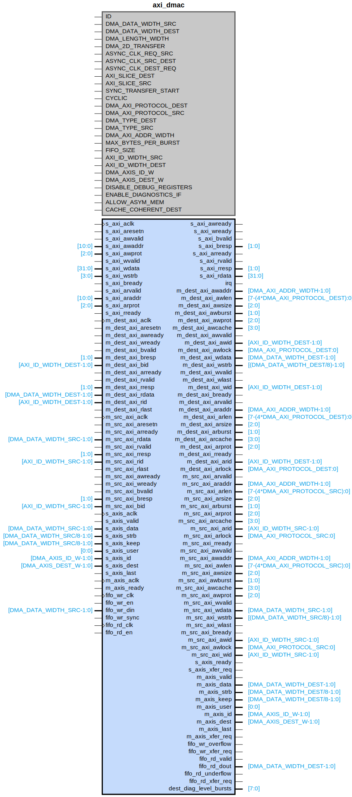

# axi_dmac

## Parameters

| Parameter | Default Value | Description |
| --------- | ------------- | ----------- |
| ID | 0 | NA |
| DMA_DATA_WIDTH_SRC | 64 | NA |
| DMA_DATA_WIDTH_DEST | 64 | NA |
| DMA_LENGTH_WIDTH | 24 | NA |
| DMA_2D_TRANSFER | false | NA |
| ASYNC_CLK_REQ_SRC | true | NA |
| ASYNC_CLK_SRC_DEST | true | NA |
| ASYNC_CLK_DEST_REQ | true | NA |
| AXI_SLICE_DEST | false | NA |
| AXI_SLICE_SRC | false | NA |
| SYNC_TRANSFER_START | false | NA |
| CYCLIC | false | NA |
| DMA_AXI_PROTOCOL_DEST | 0 | NA |
| DMA_AXI_PROTOCOL_SRC | 0 | NA |
| DMA_TYPE_DEST | 0 | NA |
| DMA_TYPE_SRC | 2 | NA |
| DMA_AXI_ADDR_WIDTH | 32 | NA |
| MAX_BYTES_PER_BURST | 128 | NA |
| FIFO_SIZE | 8 | NA |
| AXI_ID_WIDTH_SRC | 1 | NA |
| AXI_ID_WIDTH_DEST | 1 | NA |
| DMA_AXIS_ID_W | 8 | NA |
| DMA_AXIS_DEST_W | 4 | NA |
| DISABLE_DEBUG_REGISTERS | false | NA |
| ENABLE_DIAGNOSTICS_IF | false | NA |
| ALLOW_ASYM_MEM | 0 | NA |
| CACHE_COHERENT_DEST | true | NA |
| Component_Name | axi_dmac_v1_0 | NA |

## Buses

### s_axi
| Logical | Physical | Type |
| ------- | -------- | ---- |
| AWADDR | s_axi_awaddr | aximm |
| AWPROT | s_axi_awprot | aximm |
| AWVALID | s_axi_awvalid | aximm |
| AWREADY | s_axi_awready | aximm |
| WDATA | s_axi_wdata | aximm |
| WSTRB | s_axi_wstrb | aximm |
| WVALID | s_axi_wvalid | aximm |
| WREADY | s_axi_wready | aximm |
| BRESP | s_axi_bresp | aximm |
| BVALID | s_axi_bvalid | aximm |
| BREADY | s_axi_bready | aximm |
| ARADDR | s_axi_araddr | aximm |
| ARPROT | s_axi_arprot | aximm |
| ARVALID | s_axi_arvalid | aximm |
| ARREADY | s_axi_arready | aximm |
| RDATA | s_axi_rdata | aximm |
| RRESP | s_axi_rresp | aximm |
| RVALID | s_axi_rvalid | aximm |
| RREADY | s_axi_rready | aximm |

### s_axi_aclk
| Logical | Physical | Type |
| ------- | -------- | ---- |
| CLK | s_axi_aclk | clock |

### s_axi_aresetn
| Logical | Physical | Type |
| ------- | -------- | ---- |
| RST | s_axi_aresetn | reset |

### m_dest_axi
| Logical | Physical | Type |
| ------- | -------- | ---- |
| AWID | m_dest_axi_awid | aximm |
| AWADDR | m_dest_axi_awaddr | aximm |
| AWLEN | m_dest_axi_awlen | aximm |
| AWSIZE | m_dest_axi_awsize | aximm |
| AWBURST | m_dest_axi_awburst | aximm |
| AWLOCK | m_dest_axi_awlock | aximm |
| AWCACHE | m_dest_axi_awcache | aximm |
| AWPROT | m_dest_axi_awprot | aximm |
| AWVALID | m_dest_axi_awvalid | aximm |
| AWREADY | m_dest_axi_awready | aximm |
| WID | m_dest_axi_wid | aximm |
| WDATA | m_dest_axi_wdata | aximm |
| WSTRB | m_dest_axi_wstrb | aximm |
| WLAST | m_dest_axi_wlast | aximm |
| WVALID | m_dest_axi_wvalid | aximm |
| WREADY | m_dest_axi_wready | aximm |
| BID | m_dest_axi_bid | aximm |
| BRESP | m_dest_axi_bresp | aximm |
| BVALID | m_dest_axi_bvalid | aximm |
| BREADY | m_dest_axi_bready | aximm |
| ARID | m_dest_axi_arid | aximm |
| ARADDR | m_dest_axi_araddr | aximm |
| ARLEN | m_dest_axi_arlen | aximm |
| ARSIZE | m_dest_axi_arsize | aximm |
| ARBURST | m_dest_axi_arburst | aximm |
| ARLOCK | m_dest_axi_arlock | aximm |
| ARCACHE | m_dest_axi_arcache | aximm |
| ARPROT | m_dest_axi_arprot | aximm |
| ARVALID | m_dest_axi_arvalid | aximm |
| ARREADY | m_dest_axi_arready | aximm |
| RID | m_dest_axi_rid | aximm |
| RDATA | m_dest_axi_rdata | aximm |
| RRESP | m_dest_axi_rresp | aximm |
| RLAST | m_dest_axi_rlast | aximm |
| RVALID | m_dest_axi_rvalid | aximm |
| RREADY | m_dest_axi_rready | aximm |

### m_src_axi
| Logical | Physical | Type |
| ------- | -------- | ---- |
| AWID | m_src_axi_awid | aximm |
| AWADDR | m_src_axi_awaddr | aximm |
| AWLEN | m_src_axi_awlen | aximm |
| AWSIZE | m_src_axi_awsize | aximm |
| AWBURST | m_src_axi_awburst | aximm |
| AWLOCK | m_src_axi_awlock | aximm |
| AWCACHE | m_src_axi_awcache | aximm |
| AWPROT | m_src_axi_awprot | aximm |
| AWVALID | m_src_axi_awvalid | aximm |
| AWREADY | m_src_axi_awready | aximm |
| WID | m_src_axi_wid | aximm |
| WDATA | m_src_axi_wdata | aximm |
| WSTRB | m_src_axi_wstrb | aximm |
| WLAST | m_src_axi_wlast | aximm |
| WVALID | m_src_axi_wvalid | aximm |
| WREADY | m_src_axi_wready | aximm |
| BID | m_src_axi_bid | aximm |
| BRESP | m_src_axi_bresp | aximm |
| BVALID | m_src_axi_bvalid | aximm |
| BREADY | m_src_axi_bready | aximm |
| ARID | m_src_axi_arid | aximm |
| ARADDR | m_src_axi_araddr | aximm |
| ARLEN | m_src_axi_arlen | aximm |
| ARSIZE | m_src_axi_arsize | aximm |
| ARBURST | m_src_axi_arburst | aximm |
| ARLOCK | m_src_axi_arlock | aximm |
| ARCACHE | m_src_axi_arcache | aximm |
| ARPROT | m_src_axi_arprot | aximm |
| ARVALID | m_src_axi_arvalid | aximm |
| ARREADY | m_src_axi_arready | aximm |
| RID | m_src_axi_rid | aximm |
| RDATA | m_src_axi_rdata | aximm |
| RRESP | m_src_axi_rresp | aximm |
| RLAST | m_src_axi_rlast | aximm |
| RVALID | m_src_axi_rvalid | aximm |
| RREADY | m_src_axi_rready | aximm |

### fifo_rd_clk
| Logical | Physical | Type |
| ------- | -------- | ---- |
| CLK | fifo_rd_clk | clock |

### fifo_wr_clk
| Logical | Physical | Type |
| ------- | -------- | ---- |
| CLK | fifo_wr_clk | clock |

### m_axis_aclk
| Logical | Physical | Type |
| ------- | -------- | ---- |
| CLK | m_axis_aclk | clock |

### m_dest_axi_aclk
| Logical | Physical | Type |
| ------- | -------- | ---- |
| CLK | m_dest_axi_aclk | clock |

### m_src_axi_aclk
| Logical | Physical | Type |
| ------- | -------- | ---- |
| CLK | m_src_axi_aclk | clock |

### s_axis_aclk
| Logical | Physical | Type |
| ------- | -------- | ---- |
| CLK | s_axis_aclk | clock |

### m_dest_axi_aresetn
| Logical | Physical | Type |
| ------- | -------- | ---- |
| RST | m_dest_axi_aresetn | reset |

### m_src_axi_aresetn
| Logical | Physical | Type |
| ------- | -------- | ---- |
| RST | m_src_axi_aresetn | reset |

### s_axis
| Logical | Physical | Type |
| ------- | -------- | ---- |
| TREADY | s_axis_ready | axis |
| TVALID | s_axis_valid | axis |
| TDATA | s_axis_data | axis |
| TSTRB | s_axis_strb | axis |
| TKEEP | s_axis_keep | axis |
| TUSER | s_axis_user | axis |
| TID | s_axis_id | axis |
| TDEST | s_axis_dest | axis |
| TLAST | s_axis_last | axis |

### s_axis_signal_clock
| Logical | Physical | Type |
| ------- | -------- | ---- |
| CLK | s_axis_aclk | clock |

### m_axis
| Logical | Physical | Type |
| ------- | -------- | ---- |
| TREADY | m_axis_ready | axis |
| TVALID | m_axis_valid | axis |
| TDATA | m_axis_data | axis |
| TSTRB | m_axis_strb | axis |
| TKEEP | m_axis_keep | axis |
| TUSER | m_axis_user | axis |
| TID | m_axis_id | axis |
| TDEST | m_axis_dest | axis |
| TLAST | m_axis_last | axis |

### m_axis_signal_clock
| Logical | Physical | Type |
| ------- | -------- | ---- |
| CLK | m_axis_aclk | clock |

### fifo_wr
| Logical | Physical | Type |
| ------- | -------- | ---- |
| EN | fifo_wr_en | fifo_wr |
| DATA | fifo_wr_din | fifo_wr |
| OVERFLOW | fifo_wr_overflow | fifo_wr |
| SYNC | fifo_wr_sync | fifo_wr |
| XFER_REQ | fifo_wr_xfer_req | fifo_wr |

### fifo_wr_signal_clock
| Logical | Physical | Type |
| ------- | -------- | ---- |
| CLK | fifo_wr_clk | clock |

### fifo_rd
| Logical | Physical | Type |
| ------- | -------- | ---- |
| EN | fifo_rd_en | fifo_rd |
| DATA | fifo_rd_dout | fifo_rd |
| VALID | fifo_rd_valid | fifo_rd |
| UNDERFLOW | fifo_rd_underflow | fifo_rd |

### fifo_rd_signal_clock
| Logical | Physical | Type |
| ------- | -------- | ---- |
| CLK | fifo_rd_clk | clock |

### irq
| Logical | Physical | Type |
| ------- | -------- | ---- |
| INTERRUPT | irq | interrupt |

## Registers