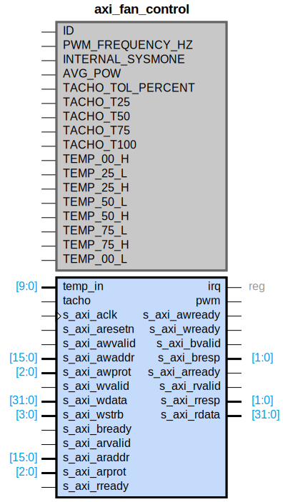

# axi_fan_control

## Parameters

| Parameter | Default Value | Description |
| --------- | ------------- | ----------- |
| ID | 0 | NA |
| PWM_FREQUENCY_HZ | 5000 | NA |
| INTERNAL_SYSMONE | 0 | NA |
| AVG_POW | 7 | NA |
| TACHO_TOL_PERCENT | 25 | NA |
| TACHO_T25 | 1470000 | NA |
| TACHO_T50 | 820000 | NA |
| TACHO_T75 | 480000 | NA |
| TACHO_T100 | 340000 | NA |
| TEMP_00_H | 5 | NA |
| TEMP_25_L | 20 | NA |
| TEMP_25_H | 40 | NA |
| TEMP_50_L | 60 | NA |
| TEMP_50_H | 70 | NA |
| TEMP_75_L | 80 | NA |
| TEMP_75_H | 90 | NA |
| TEMP_00_L | 95 | NA |
| Component_Name | axi_fan_control_v1_0 | NA |

## Buses

### s_axi
| Logical | Physical | Type |
| ------- | -------- | ---- |
| AWADDR | s_axi_awaddr | aximm |
| AWPROT | s_axi_awprot | aximm |
| AWVALID | s_axi_awvalid | aximm |
| AWREADY | s_axi_awready | aximm |
| WDATA | s_axi_wdata | aximm |
| WSTRB | s_axi_wstrb | aximm |
| WVALID | s_axi_wvalid | aximm |
| WREADY | s_axi_wready | aximm |
| BRESP | s_axi_bresp | aximm |
| BVALID | s_axi_bvalid | aximm |
| BREADY | s_axi_bready | aximm |
| ARADDR | s_axi_araddr | aximm |
| ARPROT | s_axi_arprot | aximm |
| ARVALID | s_axi_arvalid | aximm |
| ARREADY | s_axi_arready | aximm |
| RDATA | s_axi_rdata | aximm |
| RRESP | s_axi_rresp | aximm |
| RVALID | s_axi_rvalid | aximm |
| RREADY | s_axi_rready | aximm |

### s_axi_aclk
| Logical | Physical | Type |
| ------- | -------- | ---- |
| CLK | s_axi_aclk | clock |

### s_axi_aresetn
| Logical | Physical | Type |
| ------- | -------- | ---- |
| RST | s_axi_aresetn | reset |

## Registers