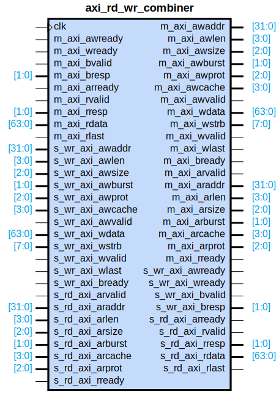

# axi_rd_wr_combiner

## Parameters

| Parameter | Default Value | Description |
| --------- | ------------- | ----------- |
| Component_Name | axi_rd_wr_combiner_v1_0 | NA |

## Buses

### m_axi
| Logical | Physical | Type |
| ------- | -------- | ---- |
| AWADDR | m_axi_awaddr | aximm |
| AWLEN | m_axi_awlen | aximm |
| AWSIZE | m_axi_awsize | aximm |
| AWBURST | m_axi_awburst | aximm |
| AWCACHE | m_axi_awcache | aximm |
| AWPROT | m_axi_awprot | aximm |
| AWVALID | m_axi_awvalid | aximm |
| AWREADY | m_axi_awready | aximm |
| WDATA | m_axi_wdata | aximm |
| WSTRB | m_axi_wstrb | aximm |
| WLAST | m_axi_wlast | aximm |
| WVALID | m_axi_wvalid | aximm |
| WREADY | m_axi_wready | aximm |
| BRESP | m_axi_bresp | aximm |
| BVALID | m_axi_bvalid | aximm |
| BREADY | m_axi_bready | aximm |
| ARADDR | m_axi_araddr | aximm |
| ARLEN | m_axi_arlen | aximm |
| ARSIZE | m_axi_arsize | aximm |
| ARBURST | m_axi_arburst | aximm |
| ARCACHE | m_axi_arcache | aximm |
| ARPROT | m_axi_arprot | aximm |
| ARVALID | m_axi_arvalid | aximm |
| ARREADY | m_axi_arready | aximm |
| RDATA | m_axi_rdata | aximm |
| RRESP | m_axi_rresp | aximm |
| RLAST | m_axi_rlast | aximm |
| RVALID | m_axi_rvalid | aximm |
| RREADY | m_axi_rready | aximm |

### s_rd_axi
| Logical | Physical | Type |
| ------- | -------- | ---- |
| ARADDR | s_rd_axi_araddr | aximm |
| ARLEN | s_rd_axi_arlen | aximm |
| ARSIZE | s_rd_axi_arsize | aximm |
| ARBURST | s_rd_axi_arburst | aximm |
| ARCACHE | s_rd_axi_arcache | aximm |
| ARPROT | s_rd_axi_arprot | aximm |
| ARVALID | s_rd_axi_arvalid | aximm |
| ARREADY | s_rd_axi_arready | aximm |
| RDATA | s_rd_axi_rdata | aximm |
| RRESP | s_rd_axi_rresp | aximm |
| RLAST | s_rd_axi_rlast | aximm |
| RVALID | s_rd_axi_rvalid | aximm |
| RREADY | s_rd_axi_rready | aximm |

### s_wr_axi
| Logical | Physical | Type |
| ------- | -------- | ---- |
| AWADDR | s_wr_axi_awaddr | aximm |
| AWLEN | s_wr_axi_awlen | aximm |
| AWSIZE | s_wr_axi_awsize | aximm |
| AWBURST | s_wr_axi_awburst | aximm |
| AWCACHE | s_wr_axi_awcache | aximm |
| AWPROT | s_wr_axi_awprot | aximm |
| AWVALID | s_wr_axi_awvalid | aximm |
| AWREADY | s_wr_axi_awready | aximm |
| WDATA | s_wr_axi_wdata | aximm |
| WSTRB | s_wr_axi_wstrb | aximm |
| WLAST | s_wr_axi_wlast | aximm |
| WVALID | s_wr_axi_wvalid | aximm |
| WREADY | s_wr_axi_wready | aximm |
| BRESP | s_wr_axi_bresp | aximm |
| BVALID | s_wr_axi_bvalid | aximm |
| BREADY | s_wr_axi_bready | aximm |

### clk
| Logical | Physical | Type |
| ------- | -------- | ---- |
| CLK | clk | clock |

### m_axi_s_wr_axi_s_rd_axi_signal_clock
| Logical | Physical | Type |
| ------- | -------- | ---- |
| CLK | clk | clock |

## Registers