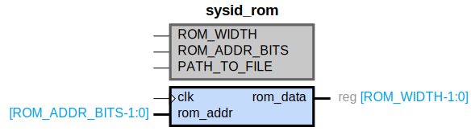

# sysid_rom

## Parameters

| Parameter | Default Value | Description |
| --------- | ------------- | ----------- |
| ROM_WIDTH | 32 | NA |
| ROM_ADDR_BITS | 6 | NA |
| PATH_TO_FILE | path_to_mem_init_file | NA |
| Component_Name | sysid_rom_v1_0 | NA |

## Buses

### clk
| Logical | Physical | Type |
| ------- | -------- | ---- |
| CLK | clk | clock |

## Registers