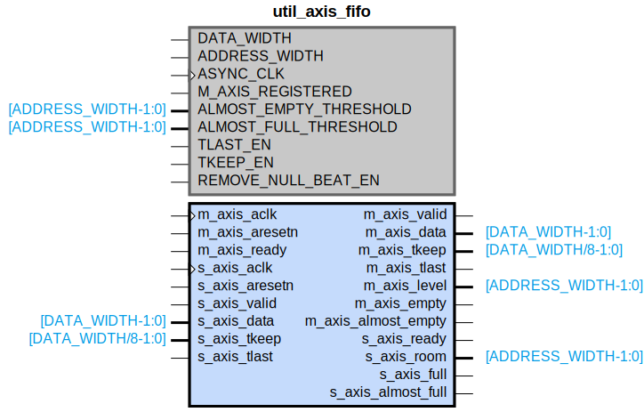

# util_axis_fifo

## Parameters

| Parameter | Default Value | Description |
| --------- | ------------- | ----------- |
| DATA_WIDTH | 64 | NA |
| ADDRESS_WIDTH | 5 | NA |
| ASYNC_CLK | 1 | NA |
| M_AXIS_REGISTERED | true | NA |
| ALMOST_EMPTY_THRESHOLD | 16 | NA |
| ALMOST_FULL_THRESHOLD | 16 | NA |
| TLAST_EN | false | NA |
| TKEEP_EN | true | NA |
| REMOVE_NULL_BEAT_EN | false | NA |
| Component_Name | util_axis_fifo_v1_0 | NA |

## Buses

### s_axis
| Logical | Physical | Type |
| ------- | -------- | ---- |
| TVALID | s_axis_valid | axis |
| TREADY | s_axis_ready | axis |
| TDATA | s_axis_data | axis |
| TLAST | s_axis_tlast | axis |
| TKEEP | s_axis_tkeep | axis |

### m_axis
| Logical | Physical | Type |
| ------- | -------- | ---- |
| TVALID | m_axis_valid | axis |
| TREADY | m_axis_ready | axis |
| TDATA | m_axis_data | axis |
| TLAST | m_axis_tlast | axis |
| TKEEP | m_axis_tkeep | axis |

### m_axis_signal_clock
| Logical | Physical | Type |
| ------- | -------- | ---- |
| CLK | m_axis_aclk | clock |

### m_axis_signal_reset
| Logical | Physical | Type |
| ------- | -------- | ---- |
| RST | m_axis_aresetn | reset |

### s_axis_signal_clock
| Logical | Physical | Type |
| ------- | -------- | ---- |
| CLK | s_axis_aclk | clock |

### s_axis_signal_reset
| Logical | Physical | Type |
| ------- | -------- | ---- |
| RST | s_axis_aresetn | reset |

## Registers