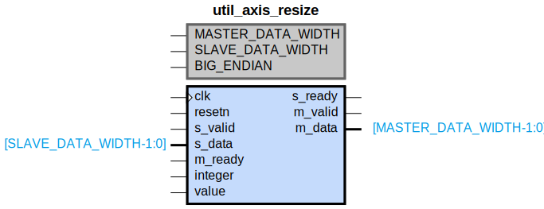

# util_axis_resize

## Parameters

| Parameter | Default Value | Description |
| --------- | ------------- | ----------- |
| MASTER_DATA_WIDTH | 64 | NA |
| SLAVE_DATA_WIDTH | 64 | NA |
| BIG_ENDIAN | 0 | NA |
| Component_Name | util_axis_resize_v1_0 | NA |

## Buses

### s_axis
| Logical | Physical | Type |
| ------- | -------- | ---- |
| TVALID | s_valid | axis |
| TREADY | s_ready | axis |
| TDATA | s_data | axis |

### m_axis
| Logical | Physical | Type |
| ------- | -------- | ---- |
| TVALID | m_valid | axis |
| TREADY | m_ready | axis |
| TDATA | m_data | axis |

### s_axis_m_axis_signal_clock
| Logical | Physical | Type |
| ------- | -------- | ---- |
| CLK | clk | clock |

### s_axis_m_axis_signal_reset
| Logical | Physical | Type |
| ------- | -------- | ---- |
| RST | resetn | reset |

## Registers