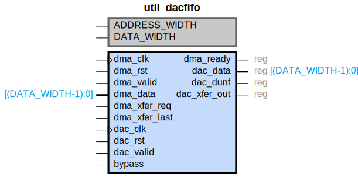

# util_dacfifo

## Parameters

| Parameter | Default Value | Description |
| --------- | ------------- | ----------- |
| ADDRESS_WIDTH | 6 | NA |
| DATA_WIDTH | 128 | NA |
| Component_Name | util_dacfifo_v1_0 | NA |

## Buses

### dma_clk
| Logical | Physical | Type |
| ------- | -------- | ---- |
| CLK | dma_clk | clock |

### dma_rst
| Logical | Physical | Type |
| ------- | -------- | ---- |
| RST | dma_rst | reset |

### dac_clk
| Logical | Physical | Type |
| ------- | -------- | ---- |
| CLK | dac_clk | clock |

### dac_rst
| Logical | Physical | Type |
| ------- | -------- | ---- |
| RST | dac_rst | reset |

## Registers