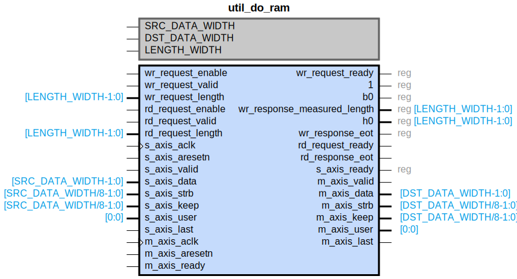

# util_do_ram

## Parameters

| Parameter | Default Value | Description |
| --------- | ------------- | ----------- |
| SRC_DATA_WIDTH | 512 | NA |
| DST_DATA_WIDTH | 128 | NA |
| LENGTH_WIDTH | 16 | NA |
| Component_Name | util_do_ram_v1_0 | NA |

## Buses

### s_axis
| Logical | Physical | Type |
| ------- | -------- | ---- |
| TREADY | s_axis_ready | axis |
| TVALID | s_axis_valid | axis |
| TDATA | s_axis_data | axis |
| TSTRB | s_axis_strb | axis |
| TKEEP | s_axis_keep | axis |
| TUSER | s_axis_user | axis |
| TLAST | s_axis_last | axis |

### m_axis
| Logical | Physical | Type |
| ------- | -------- | ---- |
| TREADY | m_axis_ready | axis |
| TVALID | m_axis_valid | axis |
| TDATA | m_axis_data | axis |
| TSTRB | m_axis_strb | axis |
| TKEEP | m_axis_keep | axis |
| TUSER | m_axis_user | axis |
| TLAST | m_axis_last | axis |

### wr_ctrl
| Logical | Physical | Type |
| ------- | -------- | ---- |
| request_enable | wr_request_enable | if_do_ctrl |
| request_valid | wr_request_valid | if_do_ctrl |
| request_ready | wr_request_ready | if_do_ctrl |
| request_length | wr_request_length | if_do_ctrl |
| response_measured_length | wr_response_measured_length | if_do_ctrl |
| response_eot | wr_response_eot | if_do_ctrl |

### rd_ctrl
| Logical | Physical | Type |
| ------- | -------- | ---- |
| request_enable | rd_request_enable | if_do_ctrl |
| request_valid | rd_request_valid | if_do_ctrl |
| request_ready | rd_request_ready | if_do_ctrl |
| request_length | rd_request_length | if_do_ctrl |
| response_eot | rd_response_eot | if_do_ctrl |

### s_axis_wr_ctrl_signal_clock
| Logical | Physical | Type |
| ------- | -------- | ---- |
| CLK | s_axis_aclk | clock |

### s_axis_wr_ctrl_signal_reset
| Logical | Physical | Type |
| ------- | -------- | ---- |
| RST | s_axis_aresetn | reset |

### m_axis_rd_ctrl_signal_clock
| Logical | Physical | Type |
| ------- | -------- | ---- |
| CLK | m_axis_aclk | clock |

### m_axis_rd_ctrl_signal_reset
| Logical | Physical | Type |
| ------- | -------- | ---- |
| RST | m_axis_aresetn | reset |

## Registers