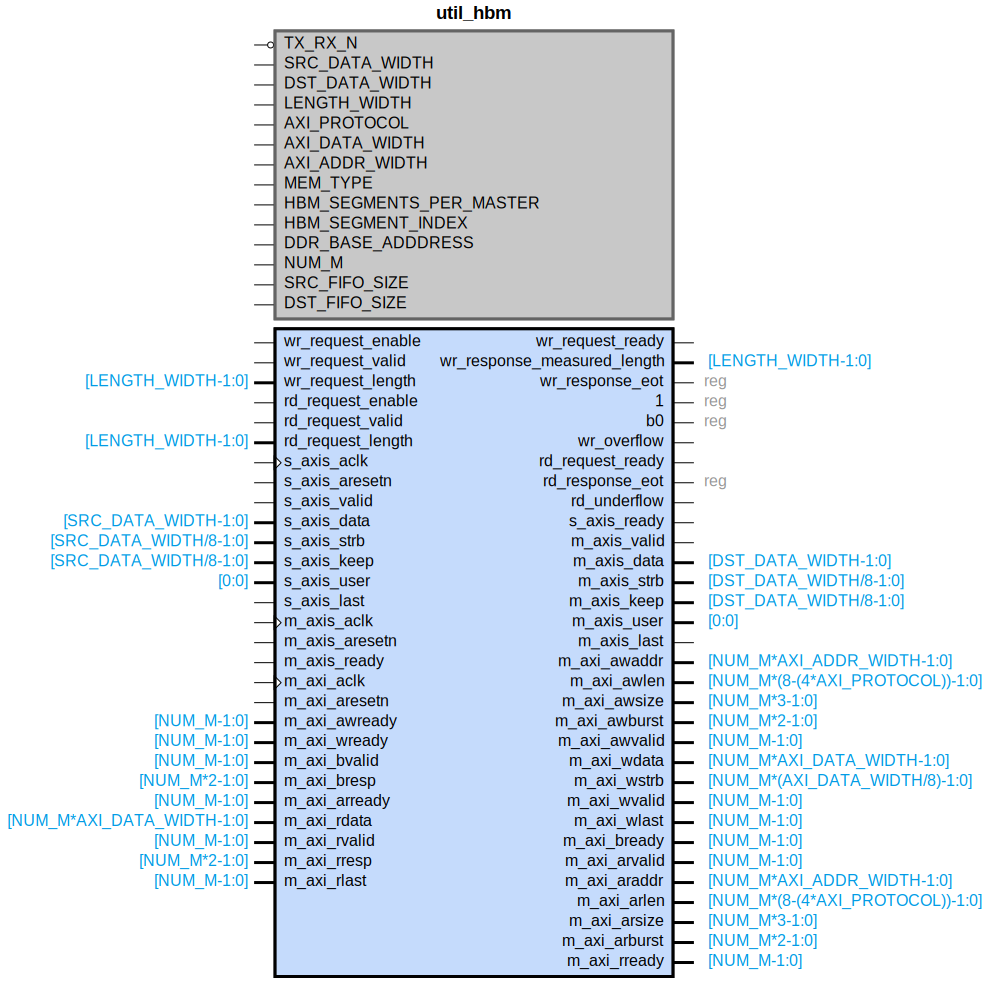

# util_hbm

## Parameters

| Parameter | Default Value | Description |
| --------- | ------------- | ----------- |
| TX_RX_N | 1 | NA |
| SRC_DATA_WIDTH | 512 | NA |
| DST_DATA_WIDTH | 512 | NA |
| LENGTH_WIDTH | 24 | NA |
| AXI_PROTOCOL | 0 | NA |
| AXI_DATA_WIDTH | 256 | NA |
| AXI_ADDR_WIDTH | 32 | NA |
| MEM_TYPE | 2 | NA |
| HBM_SEGMENTS_PER_MASTER |  | NA |
| HBM_SEGMENT_INDEX | 0 | NA |
| DDR_BASE_ADDDRESS | 0 | NA |
| NUM_M | 2 | NA |
| SRC_FIFO_SIZE | 8 | NA |
| DST_FIFO_SIZE | 8 | NA |
| Component_Name | util_hbm_v1_0 | NA |

## Buses

### s_axis
| Logical | Physical | Type |
| ------- | -------- | ---- |
| TREADY | s_axis_ready | axis |
| TVALID | s_axis_valid | axis |
| TDATA | s_axis_data | axis |
| TSTRB | s_axis_strb | axis |
| TKEEP | s_axis_keep | axis |
| TUSER | s_axis_user | axis |
| TLAST | s_axis_last | axis |

### m_axis
| Logical | Physical | Type |
| ------- | -------- | ---- |
| TREADY | m_axis_ready | axis |
| TVALID | m_axis_valid | axis |
| TDATA | m_axis_data | axis |
| TSTRB | m_axis_strb | axis |
| TKEEP | m_axis_keep | axis |
| TUSER | m_axis_user | axis |
| TLAST | m_axis_last | axis |

### MAXI_0
| Logical | Physical | Type |
| ------- | -------- | ---- |
| ARADDR | m_axi_araddr | aximm |
| ARBURST | m_axi_arburst | aximm |
| ARLEN | m_axi_arlen | aximm |
| ARREADY | m_axi_arready | aximm |
| ARSIZE | m_axi_arsize | aximm |
| ARVALID | m_axi_arvalid | aximm |
| AWADDR | m_axi_awaddr | aximm |
| AWBURST | m_axi_awburst | aximm |
| AWLEN | m_axi_awlen | aximm |
| AWREADY | m_axi_awready | aximm |
| AWSIZE | m_axi_awsize | aximm |
| AWVALID | m_axi_awvalid | aximm |
| BREADY | m_axi_bready | aximm |
| BRESP | m_axi_bresp | aximm |
| BVALID | m_axi_bvalid | aximm |
| RDATA | m_axi_rdata | aximm |
| RLAST | m_axi_rlast | aximm |
| RREADY | m_axi_rready | aximm |
| RRESP | m_axi_rresp | aximm |
| RVALID | m_axi_rvalid | aximm |
| WDATA | m_axi_wdata | aximm |
| WLAST | m_axi_wlast | aximm |
| WREADY | m_axi_wready | aximm |
| WSTRB | m_axi_wstrb | aximm |
| WVALID | m_axi_wvalid | aximm |

### MAXI_1
| Logical | Physical | Type |
| ------- | -------- | ---- |
| ARADDR | m_axi_araddr | aximm |
| ARBURST | m_axi_arburst | aximm |
| ARLEN | m_axi_arlen | aximm |
| ARREADY | m_axi_arready | aximm |
| ARSIZE | m_axi_arsize | aximm |
| ARVALID | m_axi_arvalid | aximm |
| AWADDR | m_axi_awaddr | aximm |
| AWBURST | m_axi_awburst | aximm |
| AWLEN | m_axi_awlen | aximm |
| AWREADY | m_axi_awready | aximm |
| AWSIZE | m_axi_awsize | aximm |
| AWVALID | m_axi_awvalid | aximm |
| BREADY | m_axi_bready | aximm |
| BRESP | m_axi_bresp | aximm |
| BVALID | m_axi_bvalid | aximm |
| RDATA | m_axi_rdata | aximm |
| RLAST | m_axi_rlast | aximm |
| RREADY | m_axi_rready | aximm |
| RRESP | m_axi_rresp | aximm |
| RVALID | m_axi_rvalid | aximm |
| WDATA | m_axi_wdata | aximm |
| WLAST | m_axi_wlast | aximm |
| WREADY | m_axi_wready | aximm |
| WSTRB | m_axi_wstrb | aximm |
| WVALID | m_axi_wvalid | aximm |

### MAXI_2
| Logical | Physical | Type |
| ------- | -------- | ---- |
| ARADDR | m_axi_araddr | aximm |
| ARBURST | m_axi_arburst | aximm |
| ARLEN | m_axi_arlen | aximm |
| ARREADY | m_axi_arready | aximm |
| ARSIZE | m_axi_arsize | aximm |
| ARVALID | m_axi_arvalid | aximm |
| AWADDR | m_axi_awaddr | aximm |
| AWBURST | m_axi_awburst | aximm |
| AWLEN | m_axi_awlen | aximm |
| AWREADY | m_axi_awready | aximm |
| AWSIZE | m_axi_awsize | aximm |
| AWVALID | m_axi_awvalid | aximm |
| BREADY | m_axi_bready | aximm |
| BRESP | m_axi_bresp | aximm |
| BVALID | m_axi_bvalid | aximm |
| RDATA | m_axi_rdata | aximm |
| RLAST | m_axi_rlast | aximm |
| RREADY | m_axi_rready | aximm |
| RRESP | m_axi_rresp | aximm |
| RVALID | m_axi_rvalid | aximm |
| WDATA | m_axi_wdata | aximm |
| WLAST | m_axi_wlast | aximm |
| WREADY | m_axi_wready | aximm |
| WSTRB | m_axi_wstrb | aximm |
| WVALID | m_axi_wvalid | aximm |

### MAXI_3
| Logical | Physical | Type |
| ------- | -------- | ---- |
| ARADDR | m_axi_araddr | aximm |
| ARBURST | m_axi_arburst | aximm |
| ARLEN | m_axi_arlen | aximm |
| ARREADY | m_axi_arready | aximm |
| ARSIZE | m_axi_arsize | aximm |
| ARVALID | m_axi_arvalid | aximm |
| AWADDR | m_axi_awaddr | aximm |
| AWBURST | m_axi_awburst | aximm |
| AWLEN | m_axi_awlen | aximm |
| AWREADY | m_axi_awready | aximm |
| AWSIZE | m_axi_awsize | aximm |
| AWVALID | m_axi_awvalid | aximm |
| BREADY | m_axi_bready | aximm |
| BRESP | m_axi_bresp | aximm |
| BVALID | m_axi_bvalid | aximm |
| RDATA | m_axi_rdata | aximm |
| RLAST | m_axi_rlast | aximm |
| RREADY | m_axi_rready | aximm |
| RRESP | m_axi_rresp | aximm |
| RVALID | m_axi_rvalid | aximm |
| WDATA | m_axi_wdata | aximm |
| WLAST | m_axi_wlast | aximm |
| WREADY | m_axi_wready | aximm |
| WSTRB | m_axi_wstrb | aximm |
| WVALID | m_axi_wvalid | aximm |

### MAXI_4
| Logical | Physical | Type |
| ------- | -------- | ---- |
| ARADDR | m_axi_araddr | aximm |
| ARBURST | m_axi_arburst | aximm |
| ARLEN | m_axi_arlen | aximm |
| ARREADY | m_axi_arready | aximm |
| ARSIZE | m_axi_arsize | aximm |
| ARVALID | m_axi_arvalid | aximm |
| AWADDR | m_axi_awaddr | aximm |
| AWBURST | m_axi_awburst | aximm |
| AWLEN | m_axi_awlen | aximm |
| AWREADY | m_axi_awready | aximm |
| AWSIZE | m_axi_awsize | aximm |
| AWVALID | m_axi_awvalid | aximm |
| BREADY | m_axi_bready | aximm |
| BRESP | m_axi_bresp | aximm |
| BVALID | m_axi_bvalid | aximm |
| RDATA | m_axi_rdata | aximm |
| RLAST | m_axi_rlast | aximm |
| RREADY | m_axi_rready | aximm |
| RRESP | m_axi_rresp | aximm |
| RVALID | m_axi_rvalid | aximm |
| WDATA | m_axi_wdata | aximm |
| WLAST | m_axi_wlast | aximm |
| WREADY | m_axi_wready | aximm |
| WSTRB | m_axi_wstrb | aximm |
| WVALID | m_axi_wvalid | aximm |

### MAXI_5
| Logical | Physical | Type |
| ------- | -------- | ---- |
| ARADDR | m_axi_araddr | aximm |
| ARBURST | m_axi_arburst | aximm |
| ARLEN | m_axi_arlen | aximm |
| ARREADY | m_axi_arready | aximm |
| ARSIZE | m_axi_arsize | aximm |
| ARVALID | m_axi_arvalid | aximm |
| AWADDR | m_axi_awaddr | aximm |
| AWBURST | m_axi_awburst | aximm |
| AWLEN | m_axi_awlen | aximm |
| AWREADY | m_axi_awready | aximm |
| AWSIZE | m_axi_awsize | aximm |
| AWVALID | m_axi_awvalid | aximm |
| BREADY | m_axi_bready | aximm |
| BRESP | m_axi_bresp | aximm |
| BVALID | m_axi_bvalid | aximm |
| RDATA | m_axi_rdata | aximm |
| RLAST | m_axi_rlast | aximm |
| RREADY | m_axi_rready | aximm |
| RRESP | m_axi_rresp | aximm |
| RVALID | m_axi_rvalid | aximm |
| WDATA | m_axi_wdata | aximm |
| WLAST | m_axi_wlast | aximm |
| WREADY | m_axi_wready | aximm |
| WSTRB | m_axi_wstrb | aximm |
| WVALID | m_axi_wvalid | aximm |

### MAXI_6
| Logical | Physical | Type |
| ------- | -------- | ---- |
| ARADDR | m_axi_araddr | aximm |
| ARBURST | m_axi_arburst | aximm |
| ARLEN | m_axi_arlen | aximm |
| ARREADY | m_axi_arready | aximm |
| ARSIZE | m_axi_arsize | aximm |
| ARVALID | m_axi_arvalid | aximm |
| AWADDR | m_axi_awaddr | aximm |
| AWBURST | m_axi_awburst | aximm |
| AWLEN | m_axi_awlen | aximm |
| AWREADY | m_axi_awready | aximm |
| AWSIZE | m_axi_awsize | aximm |
| AWVALID | m_axi_awvalid | aximm |
| BREADY | m_axi_bready | aximm |
| BRESP | m_axi_bresp | aximm |
| BVALID | m_axi_bvalid | aximm |
| RDATA | m_axi_rdata | aximm |
| RLAST | m_axi_rlast | aximm |
| RREADY | m_axi_rready | aximm |
| RRESP | m_axi_rresp | aximm |
| RVALID | m_axi_rvalid | aximm |
| WDATA | m_axi_wdata | aximm |
| WLAST | m_axi_wlast | aximm |
| WREADY | m_axi_wready | aximm |
| WSTRB | m_axi_wstrb | aximm |
| WVALID | m_axi_wvalid | aximm |

### MAXI_7
| Logical | Physical | Type |
| ------- | -------- | ---- |
| ARADDR | m_axi_araddr | aximm |
| ARBURST | m_axi_arburst | aximm |
| ARLEN | m_axi_arlen | aximm |
| ARREADY | m_axi_arready | aximm |
| ARSIZE | m_axi_arsize | aximm |
| ARVALID | m_axi_arvalid | aximm |
| AWADDR | m_axi_awaddr | aximm |
| AWBURST | m_axi_awburst | aximm |
| AWLEN | m_axi_awlen | aximm |
| AWREADY | m_axi_awready | aximm |
| AWSIZE | m_axi_awsize | aximm |
| AWVALID | m_axi_awvalid | aximm |
| BREADY | m_axi_bready | aximm |
| BRESP | m_axi_bresp | aximm |
| BVALID | m_axi_bvalid | aximm |
| RDATA | m_axi_rdata | aximm |
| RLAST | m_axi_rlast | aximm |
| RREADY | m_axi_rready | aximm |
| RRESP | m_axi_rresp | aximm |
| RVALID | m_axi_rvalid | aximm |
| WDATA | m_axi_wdata | aximm |
| WLAST | m_axi_wlast | aximm |
| WREADY | m_axi_wready | aximm |
| WSTRB | m_axi_wstrb | aximm |
| WVALID | m_axi_wvalid | aximm |

### MAXI_8
| Logical | Physical | Type |
| ------- | -------- | ---- |
| ARADDR | m_axi_araddr | aximm |
| ARBURST | m_axi_arburst | aximm |
| ARLEN | m_axi_arlen | aximm |
| ARREADY | m_axi_arready | aximm |
| ARSIZE | m_axi_arsize | aximm |
| ARVALID | m_axi_arvalid | aximm |
| AWADDR | m_axi_awaddr | aximm |
| AWBURST | m_axi_awburst | aximm |
| AWLEN | m_axi_awlen | aximm |
| AWREADY | m_axi_awready | aximm |
| AWSIZE | m_axi_awsize | aximm |
| AWVALID | m_axi_awvalid | aximm |
| BREADY | m_axi_bready | aximm |
| BRESP | m_axi_bresp | aximm |
| BVALID | m_axi_bvalid | aximm |
| RDATA | m_axi_rdata | aximm |
| RLAST | m_axi_rlast | aximm |
| RREADY | m_axi_rready | aximm |
| RRESP | m_axi_rresp | aximm |
| RVALID | m_axi_rvalid | aximm |
| WDATA | m_axi_wdata | aximm |
| WLAST | m_axi_wlast | aximm |
| WREADY | m_axi_wready | aximm |
| WSTRB | m_axi_wstrb | aximm |
| WVALID | m_axi_wvalid | aximm |

### MAXI_9
| Logical | Physical | Type |
| ------- | -------- | ---- |
| ARADDR | m_axi_araddr | aximm |
| ARBURST | m_axi_arburst | aximm |
| ARLEN | m_axi_arlen | aximm |
| ARREADY | m_axi_arready | aximm |
| ARSIZE | m_axi_arsize | aximm |
| ARVALID | m_axi_arvalid | aximm |
| AWADDR | m_axi_awaddr | aximm |
| AWBURST | m_axi_awburst | aximm |
| AWLEN | m_axi_awlen | aximm |
| AWREADY | m_axi_awready | aximm |
| AWSIZE | m_axi_awsize | aximm |
| AWVALID | m_axi_awvalid | aximm |
| BREADY | m_axi_bready | aximm |
| BRESP | m_axi_bresp | aximm |
| BVALID | m_axi_bvalid | aximm |
| RDATA | m_axi_rdata | aximm |
| RLAST | m_axi_rlast | aximm |
| RREADY | m_axi_rready | aximm |
| RRESP | m_axi_rresp | aximm |
| RVALID | m_axi_rvalid | aximm |
| WDATA | m_axi_wdata | aximm |
| WLAST | m_axi_wlast | aximm |
| WREADY | m_axi_wready | aximm |
| WSTRB | m_axi_wstrb | aximm |
| WVALID | m_axi_wvalid | aximm |

### MAXI_10
| Logical | Physical | Type |
| ------- | -------- | ---- |
| ARADDR | m_axi_araddr | aximm |
| ARBURST | m_axi_arburst | aximm |
| ARLEN | m_axi_arlen | aximm |
| ARREADY | m_axi_arready | aximm |
| ARSIZE | m_axi_arsize | aximm |
| ARVALID | m_axi_arvalid | aximm |
| AWADDR | m_axi_awaddr | aximm |
| AWBURST | m_axi_awburst | aximm |
| AWLEN | m_axi_awlen | aximm |
| AWREADY | m_axi_awready | aximm |
| AWSIZE | m_axi_awsize | aximm |
| AWVALID | m_axi_awvalid | aximm |
| BREADY | m_axi_bready | aximm |
| BRESP | m_axi_bresp | aximm |
| BVALID | m_axi_bvalid | aximm |
| RDATA | m_axi_rdata | aximm |
| RLAST | m_axi_rlast | aximm |
| RREADY | m_axi_rready | aximm |
| RRESP | m_axi_rresp | aximm |
| RVALID | m_axi_rvalid | aximm |
| WDATA | m_axi_wdata | aximm |
| WLAST | m_axi_wlast | aximm |
| WREADY | m_axi_wready | aximm |
| WSTRB | m_axi_wstrb | aximm |
| WVALID | m_axi_wvalid | aximm |

### MAXI_11
| Logical | Physical | Type |
| ------- | -------- | ---- |
| ARADDR | m_axi_araddr | aximm |
| ARBURST | m_axi_arburst | aximm |
| ARLEN | m_axi_arlen | aximm |
| ARREADY | m_axi_arready | aximm |
| ARSIZE | m_axi_arsize | aximm |
| ARVALID | m_axi_arvalid | aximm |
| AWADDR | m_axi_awaddr | aximm |
| AWBURST | m_axi_awburst | aximm |
| AWLEN | m_axi_awlen | aximm |
| AWREADY | m_axi_awready | aximm |
| AWSIZE | m_axi_awsize | aximm |
| AWVALID | m_axi_awvalid | aximm |
| BREADY | m_axi_bready | aximm |
| BRESP | m_axi_bresp | aximm |
| BVALID | m_axi_bvalid | aximm |
| RDATA | m_axi_rdata | aximm |
| RLAST | m_axi_rlast | aximm |
| RREADY | m_axi_rready | aximm |
| RRESP | m_axi_rresp | aximm |
| RVALID | m_axi_rvalid | aximm |
| WDATA | m_axi_wdata | aximm |
| WLAST | m_axi_wlast | aximm |
| WREADY | m_axi_wready | aximm |
| WSTRB | m_axi_wstrb | aximm |
| WVALID | m_axi_wvalid | aximm |

### MAXI_12
| Logical | Physical | Type |
| ------- | -------- | ---- |
| ARADDR | m_axi_araddr | aximm |
| ARBURST | m_axi_arburst | aximm |
| ARLEN | m_axi_arlen | aximm |
| ARREADY | m_axi_arready | aximm |
| ARSIZE | m_axi_arsize | aximm |
| ARVALID | m_axi_arvalid | aximm |
| AWADDR | m_axi_awaddr | aximm |
| AWBURST | m_axi_awburst | aximm |
| AWLEN | m_axi_awlen | aximm |
| AWREADY | m_axi_awready | aximm |
| AWSIZE | m_axi_awsize | aximm |
| AWVALID | m_axi_awvalid | aximm |
| BREADY | m_axi_bready | aximm |
| BRESP | m_axi_bresp | aximm |
| BVALID | m_axi_bvalid | aximm |
| RDATA | m_axi_rdata | aximm |
| RLAST | m_axi_rlast | aximm |
| RREADY | m_axi_rready | aximm |
| RRESP | m_axi_rresp | aximm |
| RVALID | m_axi_rvalid | aximm |
| WDATA | m_axi_wdata | aximm |
| WLAST | m_axi_wlast | aximm |
| WREADY | m_axi_wready | aximm |
| WSTRB | m_axi_wstrb | aximm |
| WVALID | m_axi_wvalid | aximm |

### MAXI_13
| Logical | Physical | Type |
| ------- | -------- | ---- |
| ARADDR | m_axi_araddr | aximm |
| ARBURST | m_axi_arburst | aximm |
| ARLEN | m_axi_arlen | aximm |
| ARREADY | m_axi_arready | aximm |
| ARSIZE | m_axi_arsize | aximm |
| ARVALID | m_axi_arvalid | aximm |
| AWADDR | m_axi_awaddr | aximm |
| AWBURST | m_axi_awburst | aximm |
| AWLEN | m_axi_awlen | aximm |
| AWREADY | m_axi_awready | aximm |
| AWSIZE | m_axi_awsize | aximm |
| AWVALID | m_axi_awvalid | aximm |
| BREADY | m_axi_bready | aximm |
| BRESP | m_axi_bresp | aximm |
| BVALID | m_axi_bvalid | aximm |
| RDATA | m_axi_rdata | aximm |
| RLAST | m_axi_rlast | aximm |
| RREADY | m_axi_rready | aximm |
| RRESP | m_axi_rresp | aximm |
| RVALID | m_axi_rvalid | aximm |
| WDATA | m_axi_wdata | aximm |
| WLAST | m_axi_wlast | aximm |
| WREADY | m_axi_wready | aximm |
| WSTRB | m_axi_wstrb | aximm |
| WVALID | m_axi_wvalid | aximm |

### MAXI_14
| Logical | Physical | Type |
| ------- | -------- | ---- |
| ARADDR | m_axi_araddr | aximm |
| ARBURST | m_axi_arburst | aximm |
| ARLEN | m_axi_arlen | aximm |
| ARREADY | m_axi_arready | aximm |
| ARSIZE | m_axi_arsize | aximm |
| ARVALID | m_axi_arvalid | aximm |
| AWADDR | m_axi_awaddr | aximm |
| AWBURST | m_axi_awburst | aximm |
| AWLEN | m_axi_awlen | aximm |
| AWREADY | m_axi_awready | aximm |
| AWSIZE | m_axi_awsize | aximm |
| AWVALID | m_axi_awvalid | aximm |
| BREADY | m_axi_bready | aximm |
| BRESP | m_axi_bresp | aximm |
| BVALID | m_axi_bvalid | aximm |
| RDATA | m_axi_rdata | aximm |
| RLAST | m_axi_rlast | aximm |
| RREADY | m_axi_rready | aximm |
| RRESP | m_axi_rresp | aximm |
| RVALID | m_axi_rvalid | aximm |
| WDATA | m_axi_wdata | aximm |
| WLAST | m_axi_wlast | aximm |
| WREADY | m_axi_wready | aximm |
| WSTRB | m_axi_wstrb | aximm |
| WVALID | m_axi_wvalid | aximm |

### MAXI_15
| Logical | Physical | Type |
| ------- | -------- | ---- |
| ARADDR | m_axi_araddr | aximm |
| ARBURST | m_axi_arburst | aximm |
| ARLEN | m_axi_arlen | aximm |
| ARREADY | m_axi_arready | aximm |
| ARSIZE | m_axi_arsize | aximm |
| ARVALID | m_axi_arvalid | aximm |
| AWADDR | m_axi_awaddr | aximm |
| AWBURST | m_axi_awburst | aximm |
| AWLEN | m_axi_awlen | aximm |
| AWREADY | m_axi_awready | aximm |
| AWSIZE | m_axi_awsize | aximm |
| AWVALID | m_axi_awvalid | aximm |
| BREADY | m_axi_bready | aximm |
| BRESP | m_axi_bresp | aximm |
| BVALID | m_axi_bvalid | aximm |
| RDATA | m_axi_rdata | aximm |
| RLAST | m_axi_rlast | aximm |
| RREADY | m_axi_rready | aximm |
| RRESP | m_axi_rresp | aximm |
| RVALID | m_axi_rvalid | aximm |
| WDATA | m_axi_wdata | aximm |
| WLAST | m_axi_wlast | aximm |
| WREADY | m_axi_wready | aximm |
| WSTRB | m_axi_wstrb | aximm |
| WVALID | m_axi_wvalid | aximm |

### _MAXI_0_MAXI_1_MAXI_2_MAXI_3_MAXI_4_MAXI_5_MAXI_6_MAXI_7_MAXI_8_MAXI_9_MAXI_10_MAXI_11_MAXI_12_MAXI_13_MAXI_14_MAXI_15_signal_clock
| Logical | Physical | Type |
| ------- | -------- | ---- |
| CLK | m_axi_aclk | clock |

### _MAXI_0_MAXI_1_MAXI_2_MAXI_3_MAXI_4_MAXI_5_MAXI_6_MAXI_7_MAXI_8_MAXI_9_MAXI_10_MAXI_11_MAXI_12_MAXI_13_MAXI_14_MAXI_15_signal_reset
| Logical | Physical | Type |
| ------- | -------- | ---- |
| RST | m_axi_aresetn | reset |

### wr_ctrl
| Logical | Physical | Type |
| ------- | -------- | ---- |
| request_enable | wr_request_enable | if_do_ctrl |
| request_valid | wr_request_valid | if_do_ctrl |
| request_ready | wr_request_ready | if_do_ctrl |
| request_length | wr_request_length | if_do_ctrl |
| response_measured_length | wr_response_measured_length | if_do_ctrl |
| response_eot | wr_response_eot | if_do_ctrl |
| status_overflow | wr_overflow | if_do_ctrl |

### rd_ctrl
| Logical | Physical | Type |
| ------- | -------- | ---- |
| request_enable | rd_request_enable | if_do_ctrl |
| request_valid | rd_request_valid | if_do_ctrl |
| request_ready | rd_request_ready | if_do_ctrl |
| request_length | rd_request_length | if_do_ctrl |
| response_eot | rd_response_eot | if_do_ctrl |
| status_underflow | rd_underflow | if_do_ctrl |

### s_axis_wr_ctrl_signal_clock
| Logical | Physical | Type |
| ------- | -------- | ---- |
| CLK | s_axis_aclk | clock |

### s_axis_wr_ctrl_signal_reset
| Logical | Physical | Type |
| ------- | -------- | ---- |
| RST | s_axis_aresetn | reset |

### m_axis_rd_ctrl_signal_clock
| Logical | Physical | Type |
| ------- | -------- | ---- |
| CLK | m_axis_aclk | clock |

### m_axis_rd_ctrl_signal_reset
| Logical | Physical | Type |
| ------- | -------- | ---- |
| RST | m_axis_aresetn | reset |

## Registers