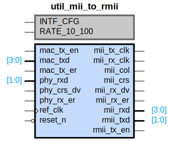

# util_mii_to_rmii

## Parameters

| Parameter | Default Value | Description |
| --------- | ------------- | ----------- |
| INTF_CFG | 0 | NA |
| RATE_10_100 | 0 | NA |
| Component_Name | util_mii_to_rmii_v1_0 | NA |

## Buses

### GMII
| Logical | Physical | Type |
| ------- | -------- | ---- |
| COL | mii_col | gmii |
| CRS | mii_crs | gmii |
| RXD | mii_rxd | gmii |
| RX_CLK | mii_rx_clk | gmii |
| RX_DV | mii_rx_dv | gmii |
| RX_ER | mii_rx_er | gmii |
| TXD | mac_txd | gmii |
| TX_CLK | mii_tx_clk | gmii |
| TX_EN | mac_tx_en | gmii |
| TX_ER | mac_tx_er | gmii |

### MII
| Logical | Physical | Type |
| ------- | -------- | ---- |
| COL | mii_col | mii |
| CRS | mii_crs | mii |
| RXD | mii_rxd | mii |
| RX_CLK | mii_rx_clk | mii |
| RX_DV | mii_rx_dv | mii |
| RX_ER | mii_rx_er | mii |
| TXD | mac_txd | mii |
| TX_CLK | mii_tx_clk | mii |
| TX_EN | mac_tx_en | mii |
| TX_ER | mac_tx_er | mii |

### RMII
| Logical | Physical | Type |
| ------- | -------- | ---- |
| CRS_DV | phy_crs_dv | rmii |
| RXD | phy_rxd | rmii |
| RX_ER | phy_rx_er | rmii |
| TXD | rmii_txd | rmii |
| TX_EN | rmii_tx_en | rmii |

### reset_n
| Logical | Physical | Type |
| ------- | -------- | ---- |
| RST | reset_n | reset |

### ref_clk
| Logical | Physical | Type |
| ------- | -------- | ---- |
| CLK | ref_clk | clock |

## Registers