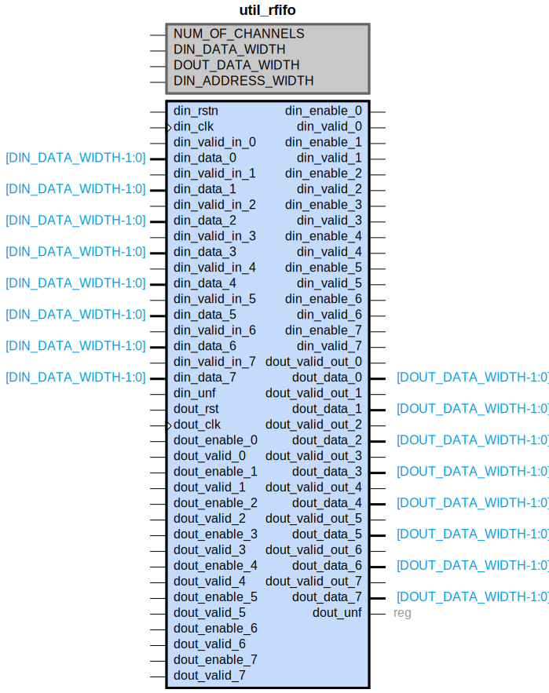

# util_rfifo

## Parameters

| Parameter | Default Value | Description |
| --------- | ------------- | ----------- |
| NUM_OF_CHANNELS | 4 | NA |
| DIN_DATA_WIDTH | 32 | NA |
| DOUT_DATA_WIDTH | 64 | NA |
| DIN_ADDRESS_WIDTH | 8 | NA |
| Component_Name | util_rfifo_v1_0 | NA |

## Buses

### din_clk
| Logical | Physical | Type |
| ------- | -------- | ---- |
| CLK | din_clk | clock |

### dout_clk
| Logical | Physical | Type |
| ------- | -------- | ---- |
| CLK | dout_clk | clock |

### din_rstn
| Logical | Physical | Type |
| ------- | -------- | ---- |
| RST | din_rstn | reset |

### dout_rst
| Logical | Physical | Type |
| ------- | -------- | ---- |
| RST | dout_rst | reset |

## Registers