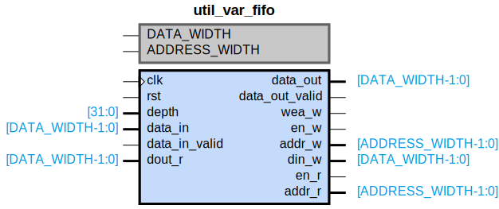

# util_var_fifo

## Parameters

| Parameter | Default Value | Description |
| --------- | ------------- | ----------- |
| DATA_WIDTH | 32 | NA |
| ADDRESS_WIDTH | 13 | NA |
| Component_Name | util_var_fifo_v1_0 | NA |

## Buses

### clk
| Logical | Physical | Type |
| ------- | -------- | ---- |
| CLK | clk | clock |

### rst
| Logical | Physical | Type |
| ------- | -------- | ---- |
| RST | rst | reset |

## Registers